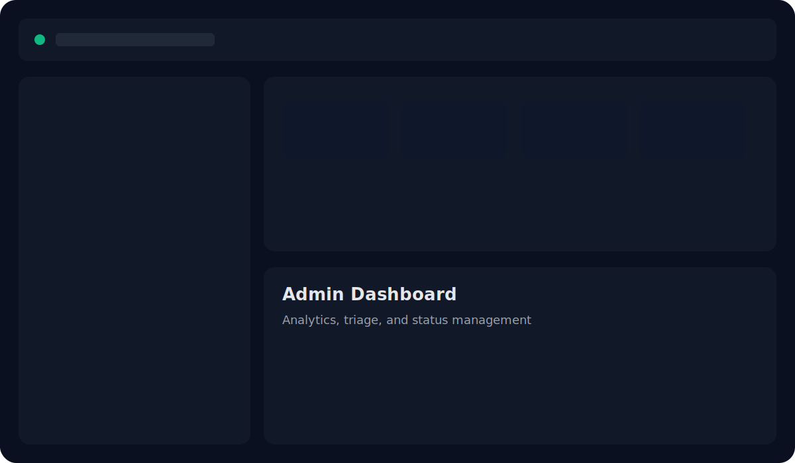
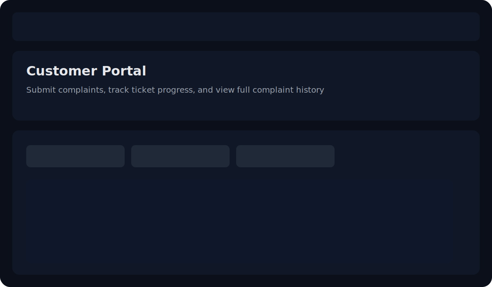
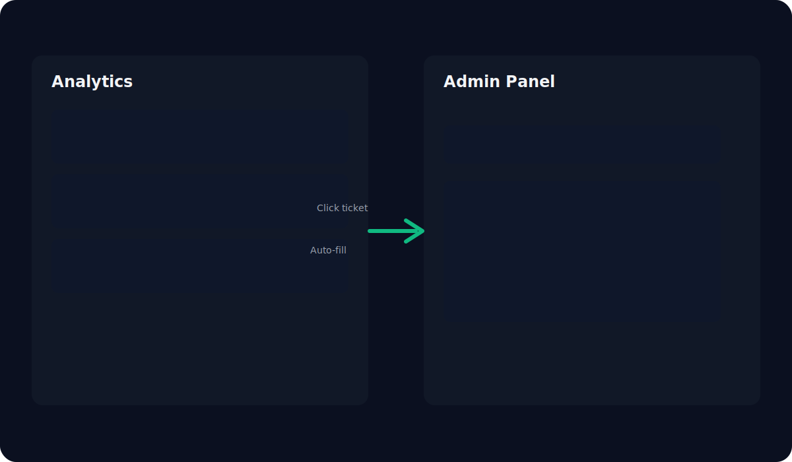
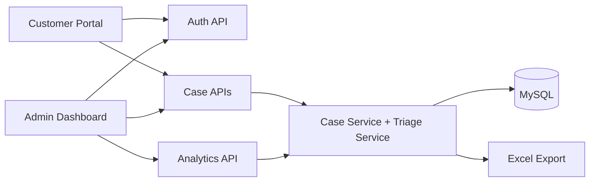

# SkyResolve

Modern airline complaint and feedback operations platform.

SkyResolve helps airlines capture customer issues, prioritize them with triage intelligence, resolve faster through role-specific workflows, and track outcomes in real time. It combines customer-facing case submission with admin-grade analytics, status control, and reporting.

<p align="left">
  <a href="https://www.java.com/">
    
  </a>
  <a href="https://spring.io/projects/spring-boot">
    
  </a>
  <a href="https://www.mysql.com/">
    
  </a>
  <a href="https://maven.apache.org/">
    
  </a>
  
  
</p>

<p align="left">
  <a href="https://airline-feedback-system.onrender.com"><strong>Live Demo</strong></a>
  ·
  <a href="#getting-started"><strong>Get Started</strong></a>
  ·
  <a href="#api-and-database"><strong>Docs</strong></a>
</p>

## Preview

<table>
  <tr>
    <td width="33%"></td>
    <td width="33%"></td>
    <td width="33%"></td>
  </tr>
</table>

UI highlights:

- Customer portal with dedicated complaint and feedback submission experience.
- Admin workspace with analytics, triage, status transitions, and resolution controls.
- Click-through analytics flow that opens Admin Panel with ticket prefilled for faster handling.

## Why This Project Exists

Airline support systems are often fragmented: one tool for intake, another for tracking, and little visibility across teams. Customers lose trust when status is unclear, while support teams lose time switching contexts.

Existing solutions frequently fail on three fronts: weak prioritization, poor ownership boundaries, and low operational insight.

SkyResolve solves this with one end-to-end flow: role-based portals, auto-triage, strict customer data isolation, and analytics that connect directly to action.

## Features

**Role-based portals with dedicated auth surfaces**

Admin and Customer each get dedicated login/signup flows and controlled access paths.

**Intelligent triage on every case**

Each submission is auto-categorized with sentiment and priority signals to speed first action.

**Customer-safe case access**

Customer APIs are bound to session email identity, preventing cross-account data leaks.

**Operational admin control**

Admins can track, update status, add resolution notes, and close cases from one panel.

**Analytics that lead to action**

Analytics entries can route straight into Admin Panel with ticket prefilled for immediate handling.

**Export-ready reporting**

All cases can be downloaded as Excel for audits, review meetings, and ops reporting.

## Tech Stack

| Layer          | Stack                                               |
| -------------- | --------------------------------------------------- |
| Frontend       | HTML, CSS, Vanilla JavaScript                       |
| Backend        | Java 17+, Spring Boot 3, Spring Web MVC, Validation |
| Database       | MySQL (primary), H2 (supported)                     |
| Data Access    | Spring Data JPA, Hibernate                          |
| Security Model | Session auth + interceptor-based role guards        |
| Reporting      | Apache POI (Excel export)                           |
| Dev Tools      | Maven, Swagger UI, Actuator                         |

## Architecture



Flow summary:

1. User authenticates and receives role-scoped session.
2. Customer submits complaint/feedback, triage runs immediately.
3. Admin tracks and resolves cases through controlled endpoints.
4. Analytics and exports are generated from live case records.

## Getting Started

### Prerequisites

- Java 17 or higher
- Maven 3.9+
- MySQL 8+

### Installation

```bash
git clone <your-repo-url>
cd aeroplane-feedback
```

### Database setup

```sql
CREATE DATABASE IF NOT EXISTS airline_cases;

CREATE USER IF NOT EXISTS 'FSAD'@'localhost' IDENTIFIED BY 'xxxxxxxxx';
ALTER USER 'FSAD'@'localhost' IDENTIFIED BY 'xxxxxxxxx';

CREATE USER IF NOT EXISTS 'FSAD'@'127.0.0.1' IDENTIFIED BY 'xxxxxxxxx';
ALTER USER 'FSAD'@'127.0.0.1' IDENTIFIED BY 'xxxxxxxxx';

GRANT ALL PRIVILEGES ON airline_cases.* TO 'FSAD'@'localhost';
GRANT ALL PRIVILEGES ON airline_cases.* TO 'FSAD'@'127.0.0.1';
FLUSH PRIVILEGES;
```

### Environment variables

Configure [.env](.env):

```env
SPRING_DATASOURCE_URL=jdbc:mysql://localhost:3306/airline_cases?useSSL=false&allowPublicKeyRetrieval=true&serverTimezone=UTC
SPRING_DATASOURCE_DRIVER_CLASS_NAME=com.mysql.cj.jdbc.Driver
SPRING_DATASOURCE_USERNAME=root
SPRING_DATASOURCE_PASSWORD=root
SPRING_JPA_HIBERNATE_DDL_AUTO=update
```

### Run locally

```bash
mvn spring-boot:run
```

App entry points:

- Landing: http://localhost:8080/landing
- Admin Login: http://localhost:8080/admin-login.html
- Admin Signup: http://localhost:8080/admin-signup.html
- Customer Login: http://localhost:8080/customer/login.html
- Customer Signup: http://localhost:8080/customer/signup.html
- Swagger: http://localhost:8080/api-docs

## Usage

### Customer flow

1. Sign up or log in as customer.
2. Submit feedback or complaint.
3. Track status and view detailed complaint history in customer portal.

### Admin flow

1. Log in as admin.
2. Open Analytics to identify active issues.
3. Click any issue to open Admin Panel with ticket prefilled.
4. Update status, add resolution, and close loop.

## API and Database

### Core APIs

**Auth**

- POST /api/auth/register
- POST /api/auth/login
- POST /api/auth/logout
- GET /api/auth/me

**Cases**

- POST /api/feedback
- POST /api/complaints
- POST /api/triage/preview
- GET /api/cases/lookup
- GET /api/cases/my
- PATCH /api/cases/{id}/status
- POST /api/cases/{id}/resolution
- DELETE /api/cases/{id}

**Analytics and export**

- GET /api/analytics/summary
- GET /api/analytics/recent
- GET /api/export/excel

### Database tables

- airline_cases
- auth_users

Quick check SQL:

```sql
USE airline_cases;
SHOW TABLES;

SELECT id, role, username, email, created_at
FROM auth_users
ORDER BY created_at DESC;

SELECT id, ticket_number, type, status, customer_email, created_at
FROM airline_cases
ORDER BY created_at DESC
LIMIT 20;
```

## Roadmap

- Admin invitation or bootstrap key for controlled admin signup.
- Stronger audit timeline for every case transition.
- SLA breach alerts and escalation workflows.
- Search and filtering for large case volumes.
- Optional AI-assisted response drafting.

## Contributing

1. Fork the repository.
2. Create a feature branch.
3. Commit focused changes with clear messages.
4. Run build checks before pushing.
5. Open a pull request with context, screenshots, and test notes.

```bash
git checkout -b feat/your-change
mvn -q -DskipTests compile
git commit -m "feat: your change"
git push origin feat/your-change
```

## License

No license file is currently included. Add a LICENSE file (for example MIT) before broad open-source distribution.

## Authors

Maintained by:

- [shreeteja172](https://github.com/shreeteja172)
- [prabhu-412](https://github.com/prabhu-412)

Built with a product-first mindset: reduce support friction, improve resolution speed, and make customer trust measurable.
